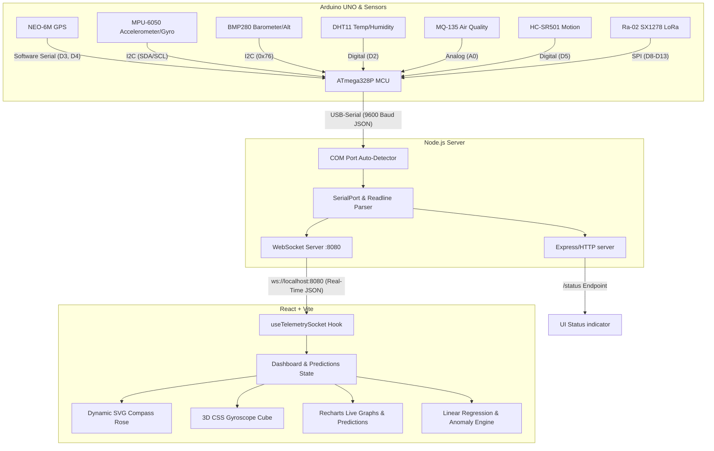

# LollyD Travel: IoT Telemetry System & Analytics Dashboard
## Full-Stack & Embedded Engineering Interview Preparation Guide

This document provides a highly technical, comprehensive breakdown of the **LollyD Travel** ecosystem. It is structured to help you confidently present the project's architecture, explain deep technical decisions, walk through codebase implementations, and successfully answer rigorous full-stack or embedded systems interview questions.

---

## 1. System Architecture Overview

The **LollyD Travel** system is a real-time, three-tier IoT telemetry and analytics platform. It bridges the physical world of microcontrollers and environmental sensors with a modern, high-performance web dashboard using a low-latency serial-to-network bridge.



### Architectural Key Highlights
* **Low-Latency Telemetry Loop:** Sensors are polled and serial JSON frames are pushed every **1000ms**, striking a balance between telemetry freshness and bandwidth limits on the Arduino UNO.
* **Loose Coupling (Decoupling):** The React frontend knows nothing about physical serial ports, and the Arduino knows nothing about IP addresses. The **Node.js bridge** acts as a stateless, resilient adapter, making the frontend easily mockable (e.g., the built-in *Demo Mode*).
* **High Tolerance to Disconnections:** The Node.js bridge incorporates active polling/retrying for USB devices, and the React client handles WebSocket reconnection lifecycles gracefully.

---

## 2. Deep-Dive: Hardware Edge (Arduino C++)

The edge hardware consists of an **Arduino UNO** (ATmega328P) polling 7 sensor modules. The code is written in embedded C++ utilizing several core communication protocols: **I2C, SPI, UART (Software Serial), Analog Inputs, and Digital GPIOs**.

### Hardware Pin Map & Interfaces
| Sensor | Physical Unit Measured | Interface Protocol | Pin Connections | Key Library Used |
| :--- | :--- | :--- | :--- | :--- |
| **NEO-6M** | GPS Coordinates, Speed, Heading | **UART (Serial)** | RX=D4, TX=D3 (9600 Baud) | `TinyGPSPlus` |
| **MPU-6050** | Acceleration, Angular Velocity | **I2C (Inter-Integrated Circuit)** | SDA=A4, SCL=A5 (Address 0x68) | `Wire.h` (Direct Registers) |
| **BMP280** | Atmospheric Pressure, Altitude | **I2C** | SDA=A4, SCL=A5 (Address 0x76) | `Adafruit_BMP280` |
| **DHT11** | Climate Temperature, Humidity | **Proprietary Single-Bus** | Digital D2 | `DHT` (Adafruit) |
| **MQ-135** | Gas Concentration (Air Quality) | **Analog Voltage** | Analog A0 | Direct `analogRead()` |
| **HC-SR501** | Infrared Occupancy (Motion) | **Digital Input** | Digital D5 | Direct `digitalRead()` |
| **Ra-02** | Wireless LoRa Transceiver (433MHz) | **SPI (Serial Peripheral Interface)** | SCK=D13, MISO=D12, MOSI=D11, CS=D10, RST=D9, DIO0=D8 | `LoRa.h` (Sandeep Mistry) |

---

### Key Firmware Implementation Techniques

#### A. Direct MPU-6050 Register Reading & Motion Trigonometry
Instead of loading heavy wrapper libraries that bloat the ATmega328P's limited flash space, the firmware directly addresses the MPU-6050 over the **I2C bus (0x68)**.
* **Initialization (Line 87-90):**
  ```cpp
  Wire.beginTransmission(MPU_ADDR);
  Wire.write(0x6B); // Addresses PWR_MGMT_1 register
  Wire.write(0x00); // Writes 0x00 to wake up MPU-6050 from sleep mode
  Wire.endTransmission(true);
  ```
* **Telemetry Fetching (Line 166-178):**
  Registers `0x3B` through `0x48` contain the 14 sequential bytes of sensor data (Accel X/Y/Z, Temp, Gyro X/Y/Z), where each reading is a 16-bit signed integer (`int16_t` split across high and low 8-bit registers). The code uses bit-shifting to reassemble them:
  ```cpp
  int16_t rawAx = Wire.read() << 8 | Wire.read();
  ```
* **Trigonometry for Pitch & Roll (Line 188-190):**
  Pitch and Roll are calculated mathematically from the normalized gravity vectors using `atan2`:
  $$\text{Pitch} = \text{atan2}(a_Y, \sqrt{a_X^2 + a_Z^2}) \times \frac{180}{\pi}$$
  $$\text{Roll} = \text{atan2}(-a_X, a_Z) \times \frac{180}{\pi}$$

#### B. Supply Voltage Self-Measurement (The 1.1V Bandgap Trick)
To determine battery/supply voltage without wasting an analog pin on a voltage divider, the code executes a clever internal routing mechanism (Line 245):
```cpp
long readVcc() {
  // Configures the ADC multiplexer to measure the internal 1.1V bandgap reference against Vcc
  ADMUX = _BV(REFS0) | _BV(MUX3) | _BV(MUX2) | _BV(MUX1);
  delay(2); // Wait for reference to settle
  ADCSRA |= _BV(ADSC); // Start conversion
  while (bit_is_set(ADCSRA, ADSC)); // Wait for conversion to complete
  long result = ADCL;
  result |= ADCH << 8;
  result = 1126400L / result; // Back-calculate Vcc in millivolts
  return result;
}
```
This compares the constant internal 1.1V reference voltage against the fluctuating supply rail ($V_{cc}$), calculating $V_{cc}$ dynamically!

#### C. Serial Bandwidth Efficiency
To prevent serial buffer overflows and reduce latency, the JSON package is manually structured and written using `Serial.print()` to skip heavy string-formatting functions (`sprintf` is extremely expensive on 8-bit MCUs and does not support floats by default). Float precision is explicitly limited (e.g., GPS latitude is printed with 6 decimal places, speed with 1).

---

## 3. Deep-Dive: Node.js Serial-to-Network Bridge

The bridge acts as an asynchronous gateway between the serial stream and network sockets. It is built purely using JavaScript running on Node.js.

### Core Dependencies
1. `@serialport/bindings-cpp` and `serialport`: Interfaces directly with native OS USB serial drivers.
2. `ws`: A fast, robust WebSocket implementation for Node.js.
3. `http`: Node's native HTTP module, exposing health checks and diagnostic telemetry.

---

### Technical Highlights of `bridge/server.js`

#### A. Plug-and-Play USB Port Auto-Detection
The server features automated device discovery. It lists all active serial interfaces and filters them by common vendor-specific USB IDs (**VID**) or manufacturer names:
```javascript
const arduinoVIDs = [
  '2341', // Official Arduino LLC
  '1A86', // CH340 / CH341 (standard on UNO clones)
  '0403', // FTDI Chipsets
  '10C4', // Silicon Labs CP210x USB-to-UART bridges
];
```
This ensures that the user does not have to hunt for COM port assignments in Windows Device Manager.

#### B. The Serial Auto-Reconnect Loop
Serial ports are highly prone to dropping (e.g., due to loose USB cables or power fluctuations). Rather than crashing, the server captures disconnect events and begins an asynchronous, non-blocking reconnect cycle:
```javascript
serialPort.on('close', () => {
  console.log('🔌 Serial port closed. Reconnecting...');
  serialPort = null;
  setTimeout(connectSerial, RECONNECT_INTERVAL); // 3000ms pause before next port scan
});
```
This is a standard production design pattern for industrial edge gateways.

#### C. Stream Framing via Readline Parser
A raw serial stream can deliver fragmented or partial strings. To prevent JSON parsing errors, the stream is piped through a `ReadlineParser` with an explicit newline delimiter:
```javascript
const parser = serialPort.pipe(new ReadlineParser({ delimiter: '\n' }));
```
This aggregates raw buffers into complete text strings before passing them to the application logic.

---

## 4. Deep-Dive: Real-Time React Analytics Dashboard

The React single-page application is created over a modern Vite environment, prioritizing sub-millisecond visual updates, beautiful interface styling, and advanced forecasting.

### 3D Device Visualization (CSS 3D Transforms)
In the dashboard's `OrientationCube` component, the MPU-6050's pitch, roll, and yaw angles are dynamically mapped to a physical visual element using standard 3D CSS:
```jsx
function OrientationCube({ pitch = 0, roll = 0, yaw = 0 }) {
  return (
    <div className="cube-scene">
      <div className="cube" style={{ transform: `rotateX(${-pitch}deg) rotateY(${yaw}deg) rotateZ(${-roll}deg)` }}>
        <div className="cube-face cube-front">FRONT</div>
        <div className="cube-face cube-back">BACK</div>
        {/* Left, Right, Top, Bottom faces... */}
      </div>
    </div>
  );
}
```
Combined with standard CSS perspective settings (`perspective: 600px` on `.cube-scene` and `transform-style: preserve-3d` on `.cube`), this delivers real-time 3D rotation in any web browser without the overhead of heavy WebGL libraries like Three.js.

---

### Math & Logic: Predictive Analytics

The prediction page uses **Ordinary Least Squares (OLS) Linear Regression** to forecast where sensor telemetry is heading.

#### Linear Regression Engine (`generatePredictionCurve`):
The function calculates the line of best fit ($y = mx + b$) across the existing historical sliding window ($N$ elements):
```javascript
let sumX = 0, sumY = 0;
for (let i = 0; i < n; i++) {
  sumX += i;
  sumY += (history[i][key] || 0);
}
const meanX = sumX / n;
const meanY = sumY / n;

let num = 0, den = 0;
for(let i = 0; i < n; i++) {
  const y = history[i][key] || 0;
  num += (i - meanX) * (y - meanY);
  den += (i - meanX) * (i - meanX);
}
const m = den === 0 ? 0 : num / den; // Calculates slope (m)
```
After establishing the slope ($m$), the algorithm projects **30 seconds into the future**, rendering a dotted extrapolation curve alongside the solid actual readings in `Recharts` charts. This displays a true live forecast.

#### Key Derived Analytics Formulae:
* **Operational Range Prediction (Line 117):**
  $$\text{Range (km)} = \text{Battery } \% \times 3.4 \times \left( \frac{120}{\max(80, \text{speed})} \right)$$
  This scales efficiency inversely with speed, modeling wind resistance and energy drain dynamics.
* **Time To Empty (TTE) (Line 118-119):**
  $$\text{Drain Rate} = \max(0.1, \frac{\text{Speed}}{150})$$
  $$\text{Minutes remaining} = \frac{\text{Battery } \%}{\text{Drain Rate}}$$
* **Barometric Weather Predictor (Line 125-128):**
  * $P < 980\text{ hPa} \rightarrow$ **Storm Warning**
  * $P < 1000\text{ hPa} \rightarrow$ **Rain Likely**
  * $P > 1020\text{ hPa} \rightarrow$ **Clear Skies**
  * Else $\rightarrow$ **Stable Environment**
* **Dynamic Anomaly Detection (Line 130-131):**
  Triggers a system-wide safety alert if $\vert\text{Pitch}\vert > 15^\circ$ or $\vert\text{Roll}\vert > 15^\circ$ or lateral acceleration forces exceed nominal bounds, simulating vehicle rollover or crash alerts.

---

## 5. Typical Interview Q&As (Succeeding in the Technical Loop)

### Q1: Why use WebSockets instead of polling HTTP `/status`?
**Answer:**
> "WebSockets are crucial here to ensure low latency and minimal bandwidth overhead. HTTP polling requires establishing a new TCP connection (via three-way handshake) and transmitting heavy headers for every telemetry check, creating high latency and massive network overhead. WebSockets, on the other hand, upgrade a single HTTP connection into a persistent, bi-directional TCP socket. Data frames are sent immediately by the server in raw text with just a few bytes of framing overhead, allowing smooth 1Hz or faster rendering on the dashboard."

### Q2: How does the Arduino ensure it doesn't block while reading the GPS or LoRa signals?
**Answer:**
> "We design the loop to be entirely non-blocking. Instead of using hard delays (like `delay(1000)`), we implement a timing check using `millis() - lastSendTime >= SEND_INTERVAL`. This keeps the processor free during cycles. In every single pass of the main `loop()`, we feed the serial buffer into the GPS parser (`gps.encode(gpsSerial.read())`) and query the LoRa buffer (`LoRa.parsePacket()`). Both functions are non-blocking; they execute instantly and only trigger action when complete packets arrive, ensuring zero telemetry drop."

### Q3: What is I2C, and how does it differ from SPI, which you used for LoRa?
**Answer:**
> "Both are synchronous, short-distance board-level serial protocols, but they serve different engineering constraints:
> * **I2C (Inter-Integrated Circuit):** Uses only two wires—SDA (Serial Data) and SCL (Serial Clock). It relies on open-drain lines with pull-up resistors and addresses devices using a software address (like `0x68` for the IMU, `0x76` for the BMP). This is highly pins-efficient, allowing us to chain the IMU and BMP on the exact same two pins.
> * **SPI (Serial Peripheral Interface):** Uses four dedicated high-speed wires—MISO, MOSI, SCK, and a physical SS/CS (Chip Select) wire. SPI is push-pull, operates at much higher clock speeds, and utilizes hardware chip select pins. We use it for the Ra-02 LoRa transceiver because high-frequency radio data packets require high SPI throughput, whereas I2C would suffer from slower bus speeds."

### Q4: How does the React app handle performance to prevent UI lag while processing high-frequency data streams?
**Answer:**
> "To maintain standard 60FPS UI performance, we apply several optimizations:
> 1. **Component Decoupling:** Live charts and telemetry details are separated so that only the necessary nodes re-render on socket frames.
> 2. **Efficient State Management:** In our custom `useTelemetrySocket` hook, we cap the historical sliding window array to a maximum of 40-50 elements. Older data points are automatically shifted out of the state queue. This keeps DOM operations and Recharts graph re-calculations constant ($O(1)$ complexity) instead of growing infinitely.
> 3. **Hardware Acceleration:** The MPU-6050's orientation updates bypass Javascript layout computation entirely. We map the angles directly to CSS 3D transforms (`rotateX`/`rotateY`), pushing rendering directly onto the system's GPU rather than clogging the browser's CPU thread."

### Q5: How would you scale this system if we had 10,000 active travel sensor devices?
**Answer:**
> "To scale this to production volumes, the current local Node.js bridge would be replaced with a cloud-native IoT gateway. 
> 1. **Edge Protocol:** The device would transmit telemetry via **MQTT** (Message Queuing Telemetry Transport) or CoAP over cellular/cellular-IoT (like LTE-M/NB-IoT) instead of local USB-serial. MQTT has extremely lightweight headers, standard keep-alives, and QOS levels.
> 2. **Ingestion Layer:** A message broker like **Apache Kafka** or AWS IoT Core would capture incoming MQTT payloads, buffering high-throughput streams.
> 3. **Storage & Analytics:** Telemetry would split into two paths: a **hot path** (using a Time-Series database like InfluxDB or TimescaleDB for quick live charting) and a **cold path** (using S3 and Athena for historical ML model training).
> 4. **Dashboard Service:** The React frontend would connect to a cluster of WebSocket servers managed by Redis Pub/Sub, ensuring that frontend instances scale horizontally."

---

## 6. How to Run & Demonstrate the Project (Quick Sheet)

Ensure you practice running the live stack so you can demo it smoothly in interviews:

### 1. Embedded Layer (Arduino)
* **Open:** Open `travel_sensor.ino` in the Arduino IDE.
* **Libraries:** Make sure to install `TinyGPSPlus`, `Adafruit_BMP280`, `DHT`, and `LoRa` packages.
* **Upload:** Connect your UNO via USB and click **Upload**.

### 2. Network Bridge
```bash
cd bridge
npm install
node server.js
```
*Observe console outputs confirming the auto-detected COM port and local WebSocket hosting.*

### 3. Frontend Dashboard
```bash
npm install
npm run dev
```
*Open `http://localhost:5173`. Select **Live Mode** and enter `ws://localhost:8080` (or select **Demo Mode** to instantly display pre-populated telemetry trends if hardware is disconnected).*

---
**Tip for the Interview:** Highlight that this project demonstrates full product lifecycle capability: from soldering and firmware register configuration to real-time network transport, linear regression mathematics, and premium dynamic UI aesthetics!
